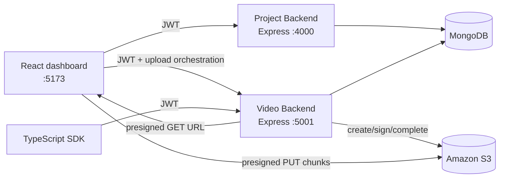

# Video Upload Microservice

A TypeScript video platform built around direct-to-S3 multipart uploads. Users authenticate through a project API, create projects, upload videos through the video API, and browse video metadata and presigned playback URLs from the React dashboard.

## Architecture



The repository is split into four independently runnable packages:

- `ProjectBackend`: registration, login, current-user, project creation, and project/video associations.
- `Backend`: authenticated video upload lifecycle, video metadata, presigned S3 URLs, Swagger docs, and stale-upload cleanup.
- `Frontend`: Vite + React dashboard for auth, projects, uploads, and video playback.
- `sdk`: TypeScript client for multipart uploads and video metadata access.

## Tech Stack

- **Runtime:** Node.js 20, TypeScript, pnpm
- **APIs:** Express 5, JWT, Helmet, CORS, express-validator, express-rate-limit
- **Persistence:** MongoDB with Mongoose
- **Object storage:** Amazon S3 with AWS SDK v3 and presigned URLs
- **Frontend:** React 19, Vite, Tailwind CSS, React Router, Framer Motion
- **SDK:** TypeScript and Axios
- **Operations:** Docker Compose, Pino logging, Swagger UI

## Quick Start

### Prerequisites

- Node.js 20+
- pnpm 10+
- Docker Desktop, or a local MongoDB instance
- An S3 bucket and AWS credentials with multipart upload and object read permissions

### 1. Install dependencies

Run this once in each package directory:

```bash
cd ProjectBackend && pnpm install
cd ../Backend && pnpm install
cd ../Frontend && pnpm install
cd ../sdk && pnpm install
```

### 2. Configure environment variables

Create `Backend/.env` and `ProjectBackend/.env` using the variables below. The frontend values are Vite build-time variables and can be placed in `Frontend/.env`.

### 3. Start infrastructure and APIs

To run MongoDB and the video backend together with Docker Compose:

```bash
cd Backend
docker compose up --build
```

The Compose file exposes MongoDB on `27017` and the video API on `5001`. For a local Node.js run, start MongoDB separately and use `pnpm dev` from `Backend` instead. The project API is started separately:

```bash
cd ProjectBackend
pnpm dev
```

Start the dashboard in another terminal:

```bash
cd Frontend
pnpm dev
```

Open <http://localhost:5173>. API documentation is available at <http://localhost:5001/docs>.

For production-style builds:

```bash
cd ProjectBackend && pnpm build && pnpm start
cd ../Backend && pnpm build && pnpm start
cd ../Frontend && pnpm build && pnpm preview
```

## Environment Variables

### `Backend/.env`

| Variable | Example | Purpose |
| --- | --- | --- |
| `PORT` | `5001` | Video API port |
| `MONGO_URI` | `mongodb://127.0.0.1:27017/video_microservice` | Video metadata database |
| `AWS_REGION` | `us-east-1` | S3 region |
| `AWS_ACCESS_KEY_ID` | `...` | AWS access key |
| `AWS_SECRET_ACCESS_KEY` | `...` | AWS secret key |
| `AWS_BUCKET_NAME` | `my-video-bucket` | Upload and playback bucket |
| `JWT_SECRET` | `replace-me` | Token verification secret shared with the project API |
| `CORS_ORIGIN` | `http://localhost:5173` | Allowed browser origin; defaults to `*` |
| `SERVER_URL` | `http://localhost:5001` | Optional Swagger server URL input |

### `ProjectBackend/.env`

| Variable | Example | Purpose |
| --- | --- | --- |
| `PORT` | `4000` | Project API port |
| `MONGO_URI` | `mongodb://127.0.0.1:27017/project_backend` | User and project database |
| `JWT_SECRET` | `replace-me` | Token signing secret; keep it equal to the video API value |
| `CORS_ORIGIN` | `http://localhost:5173` | Allowed browser origin |

### `Frontend/.env`

| Variable | Example | Purpose |
| --- | --- | --- |
| `VITE_PROJECT_API_URL` | `http://localhost:4000/api` | Project API base URL |
| `VITE_VIDEO_API_URL` | `http://localhost:5001/api/v1` | Video API base URL |

Never commit real credentials. The repository ignores `.env` files; use environment-specific secret storage in deployment.

## API Example

Register and keep the returned JWT for authenticated requests:

```bash
curl -X POST http://localhost:4000/api/auth/register \
  -H "Content-Type: application/json" \
  -d '{"email":"owner@example.com","password":"change-me","name":"Owner"}'
```

Initialize a video upload through the video API:

```bash
curl -X POST http://localhost:5001/api/v1/upload/init \
  -H "Authorization: Bearer $TOKEN" \
  -H "Content-Type: application/json" \
  -d '{"fileName":"demo.mp4","contentType":"video/mp4","fileSize":10485760}'
```

The response contains `videoId`, `uploadId`, and the S3 object key. For each 5 MB part, request a presigned URL, upload the chunk directly to S3 with `PUT`, then confirm the part with its returned `ETag`. Complete the upload with:

```bash
curl -X POST http://localhost:5001/api/v1/upload/complete \
  -H "Authorization: Bearer $TOKEN" \
  -H "Content-Type: application/json" \
  -d '{"videoId":"VIDEO_ID"}'
```

Useful endpoints:

| Method | Endpoint | Description |
| --- | --- | --- |
| `GET` | `/health` | Liveness check |
| `GET` | `/ready` | MongoDB readiness check |
| `POST` | `/api/auth/register` | Create an account |
| `POST` | `/api/auth/login` | Get a seven-day JWT |
| `GET` | `/api/projects` | List the authenticated user’s projects |
| `POST` | `/api/v1/upload/init` | Start an S3 multipart upload |
| `POST` | `/api/v1/upload/sign-part` | Create a presigned part URL |
| `POST` | `/api/v1/upload/confirm-part` | Persist a completed part and ETag |
| `POST` | `/api/v1/upload/complete` | Complete the S3 upload |
| `GET` | `/api/v1/videos` | List videos |
| `GET` | `/api/v1/videos/:videoId` | Get metadata and a presigned download URL |
| `GET` | `/api/v1/videos/status/:videoId` | Read upload status |

The complete OpenAPI UI is available at `/docs` on the video backend.

## SDK Example

The SDK exposes `UploadClient`, which uploads a browser `File` and reports progress:

```ts
import { UploadClient } from '@chetan/video-upload-sdk';

const client = new UploadClient(
  'http://localhost:5001/api/v1',
  token
);

const result = await client.upload(file, (percent) => {
  console.log(`${percent}%`);
});
```

Uploads use 5 MB chunks and up to three concurrent part uploads. The SDK retries S3 `PUT` requests, while the API calls remain authenticated with the supplied bearer token.

## Architecture Decisions

- **Presigned S3 URLs:** large file bytes bypass the API servers, reducing memory pressure and network transfer through Express.
- **Multipart uploads:** files are split into resumable, independently confirmable parts; the client controls concurrency.
- **MongoDB as upload state:** the video document records ownership, S3 identity, confirmed ETags, and lifecycle status so completion can be coordinated safely.
- **Layered video backend:** controllers depend on core services, which depend on repository and storage interfaces. The service container keeps those dependencies replaceable for tests and future storage providers.
- **Separate project and video APIs:** account/project concerns and high-volume object-storage operations have independent deployment and scaling boundaries.
- **Defensive operations:** Helmet, rate limits, request logging, readiness checks, graceful shutdown, and a scheduled cleanup job cover the baseline operational needs.

## Screenshots

No screenshots are currently committed to the repository. The primary UI is the authenticated dashboard at `Frontend/src/pages/DashboardPage.tsx`, with upload progress, project navigation, video cards, and a video player modal. Capturing the dashboard and Swagger UI after local setup would make this section more useful for reviewers.

## Known Limitations

- There is no video transcoding, thumbnail generation, virus scanning, or background processing worker yet; the current pipeline stores and serves the original object.
- AWS credentials are configured through environment variables and the S3 client is created with explicit credentials. Production deployments should prefer workload identity or an AWS role.
- `CORS_ORIGIN` defaults to `*`; set it explicitly outside local development.
- The two backends use separate MongoDB databases by default and share JWT signing configuration rather than a shared user model.
- The SDK currently uses different base-path conventions: upload methods expect a URL ending in `/api/v1`, while `VideoClient` appends `/api/v1` itself. Use the upload methods carefully or normalize this client contract before publishing the SDK.
- The cleanup job runs every 15 minutes and marks stale database records failed; deployment should also monitor abandoned S3 multipart uploads with an S3 lifecycle rule.

## Repository Layout

```text
Backend/         Video API, S3 integration, Mongo video repository, Swagger
ProjectBackend/  Auth and project API
Frontend/        React/Vite dashboard
sdk/             TypeScript upload and video clients
```
